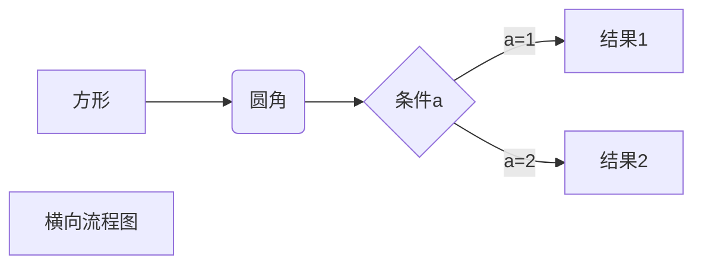

# 以下是 markdown 一些常见语法 h1 标题

## 以下是 markdown 一些常见语法 h2 标题

### 以下是 markdown 一些常见语法 h3 标题

---

---

<u>带下划线文本</u>

-   第一项
-   第二项
-   第三项

1. 第一项
2. 第二项
3. 第三项

> 123
>
> > 345

~~删除~~

_斜体_

**粗体**



1. 第一项
2. 第二项
3. 第三项

4. 第一项：
    - 第一项嵌套的第一个元素
    - 第一项嵌套的第二个元素
5. 第二项： -第二项嵌套的第一个元素 -第二项嵌套的第二个元素


----------
>>> 以下为markdown语法测试，不用记忆：
----------

| 左对齐 | 右对齐 | 居中对齐 |
| :-----| ----: | :----: |
| 单元格 | 单元格 | 单元格 |
| 单元格 | 单元格 | 单元格 |

八、表格
语法：

|表头|表头|表头|
|:---|:---:|---:|
|内容11111111111111|内容22222222222222222|内容3333333333|
|内容|内容|内容|

第二行分割表头和内容。
- 有一个就行，为了对齐，多加了几个
文字默认居左
-两边加：表示文字居中
-右边加：表示文字居右
注：原生的语法两边都要用 | 包起来。此处省略

----
###接口详情（id： 154923）：
###### 接口名称：    用户更新
###### 请求类型：    post
###### 请求url：   api/u/update
###### 接口描述：    用户信息更新，可更新的信息包括： avatar.gengder.age.nickname.breed

###请求参数列表
|变量名        |含义     |类型     |备注********     |
|-----|:---:|:-----:|:------:|
|       user           |用户信息|object  |      |

|age //1-100|用户年龄|number|无        |
|:-------:|:-----:|------:|:------:|
|avatar |用户头像|string|@mock=@IMG(200*200)|
|gender//1|性别|string|@mock=['男', '女']|
|nickname//3-5|昵称|string| @mock='测试用户'|

###响应参数列表
|变量名 |含义 |类型 |备注******** |
|-----|:---:|:-----:|:------:|
|data|        |object  |     |
|age //1-100|用户年龄|number|        |
|avatar |用户头像|string|@mock=@IMG(200*200)|
|gender//1|性别|string|@mock=['男', '女']|
|nickname//3-5|昵称|string| @mock='测试用户'|
|success|更新操作成功与否|boolean| @mock=true|

----


十、流程图

```flow
st=>start: 开始
op=>operation: My Operation
cond=>condition: Yes or No?
e=>end
st->op->cond
cond(yes)->e
cond(no)->op
&
```


##  十一 水平线

___

---

***


```flow
st=>start: 开始框
op=>operation: 处理框
cond=>condition: 判断框(是或否?)
sub1=>subroutine: 子流程
io=>inputoutput: 输入输出框
e=>end: 结束框
st->op->cond
cond(yes)->io->e
cond(no)->sub1(right)->op
```

