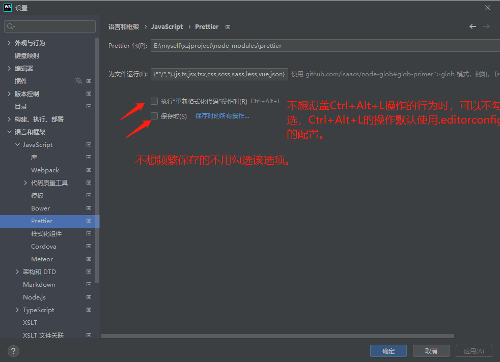

# 过程中FAQ备忘

# 1.

当反复更改 .editorconfig 或者 .eslintrc.js 文件（修改后Ctrl+S：保存）后，在其他文件（添个空行）中，使用快捷键（Ctrl+Shfit+L(
在WebStorm里是启动‘重新格式化代码’)或者Ctrl+Alt+Shift+P(在WebStorm里是启动‘使用Prettier重新格式化代码’)
）格式化代码时，我发现，会出现代码格式化的结果的格式不符合我配置文件刚修改过的规则，而是符合我修改之前的规则。这些规则无论是在.editorconfig 文件里还是在 .eslintrc.js
文件里。

由于Webstorm 重新格式化代码功能会出现这种bug现象，我建议： 每次修改完代码风格配置文件后，重启WebStorm编辑器。

可能的原因：
由于格式化代码的功能本质上也是调用命令行来处理代码，所以，配置文件改变时，命令行的特性是临时终端，而临时终端对于配置文件的更改可能是不敏感的，要改变临时终端的环境变量（环境变量包括这些配置文件），建议对命令行终端进行销毁和新建，也就是上面建议的重启WebStorm编辑器。

# 2.

WebStorm 关于 Ctrl+Alt+L 的用法介绍，说了它会使用 .editorconfig 配置文件：
---官网文档地址：https://www.jetbrains.com/help/webstorm/reformat-and-rearrange-code.html

# 3.

如果你的项目里存在一个 .editorconfig 文件，Prettier 将解析它并将其属性转换为相应的 Prettier 配置。此配置将被.prettierrc 覆盖，等等。目前，支持的
EditorConfig 属性如下：

end_of_line indent_style indent_size/tab_width max_line_length

出处： https://prettier.io/docs/en/api.html#prettierresolveconfigfilepath--options

# 4.

在 WebStorom 中 Prettier是怎么使用的：
https://www.jetbrains.com/help/webstorm/prettier.html#ws_prettier_reformat_code

过程简述：在 WebStorm 中打开设置面板, 然后打开路径 "语言与框架" | JavaScript | Prettier, 进行配置：
。

在编辑器的编辑区域可以使用快捷键（Ctrl+Alt+Shift+P）去重新格式化代码片段，如果想要重新格式化文件或文件夹，需要在项目工具窗选中，然后在使用快捷键或点击右键选择用Prettier重新格式化。

